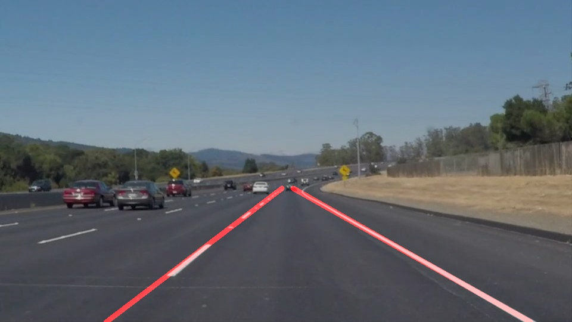

# **Finding Lane Lines on the Road** 

## Writeup Template

### You can use this file as a template for your writeup if you want to submit it as a markdown file. But feel free to use some other method and submit a pdf if you prefer.

---

**Finding Lane Lines on the Road**

The goals / steps of this project are the following:
* Make a pipeline that finds lane lines on the road
* Reflect on your work in a written report

[//]: # (Image References)

---

### Reflection

### 1. Describe your pipeline. As part of the description, explain how you modified the draw_lines() function.

My pipeline consisted the following steps:

1) Convert the image to grayscale
2) Apply a gaussian blur to remove noise. 
3) Create a 4-sided polygon to create a mask of the region of the lane lines and apply it to the image from step 2. 
4) Identify lines within the image using the hough transform. 
5) Apply the lines to the image. 

In order to create a single line that is placed over each of the traffic markings I first identified the points that were 
associated with the left and right traffic markings by calculating the slopes of each of the lines returned from the hough tranform method. Using these points I created a linear regression model that returned the slope and intercept of the line of best fit (for both the left and right traffic marks). Using the slope and intercept returned from the linear regression model I created two points (lets call them A and B). Point A has a y value of the 315 (upper most region of the traffic marks) and point B has the y value of the bottom of the image. Using the slope and intercept mentioned before I solved for the variable x (from the slope-intercept form of the equation of a line) using the y values of both point A and B. Afterwards, I created a line using points A and B. 

Note: During the process of identifying the right and left traffic marks using the hough tranform I also filtered the points to ensure that no point was outside the region of their respective traffic mark region. If a point was out of bounds it would be discarded.

### 2. Identify potential shortcomings with your current pipeline

One potential shortcoming would be what would happen when there is debris located on the traffic markings. This could complicate the process of identifying the highway markings. Another shortcoming would be how the pipeline would handle non-existant traffic marks and faded traffic marks. 

### 3. Suggest possible improvements to your pipeline

A possible improvement would be to fine-tune the parameters of the pipeline to increase the accuracy of the highlighted lines. Currently it's quite tedious to tune the parameters by hande given the amount of time it takes to analyze the videos. One possible way to accomplish this might be to create a genetic algorithm that would find the best parameters. The only issue with this approach is coming up with a way to assess the "fitness" of a set of parameters.  
